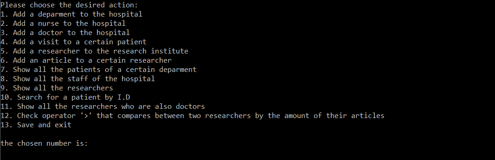
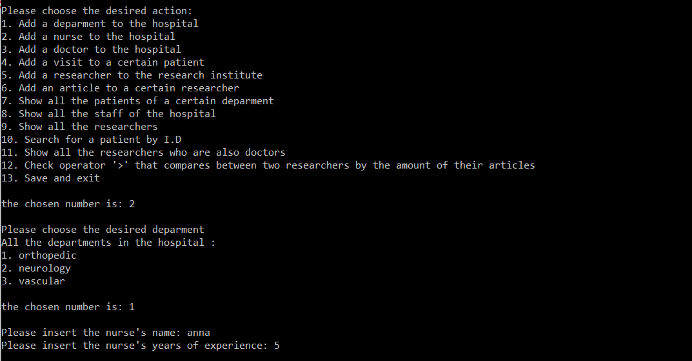
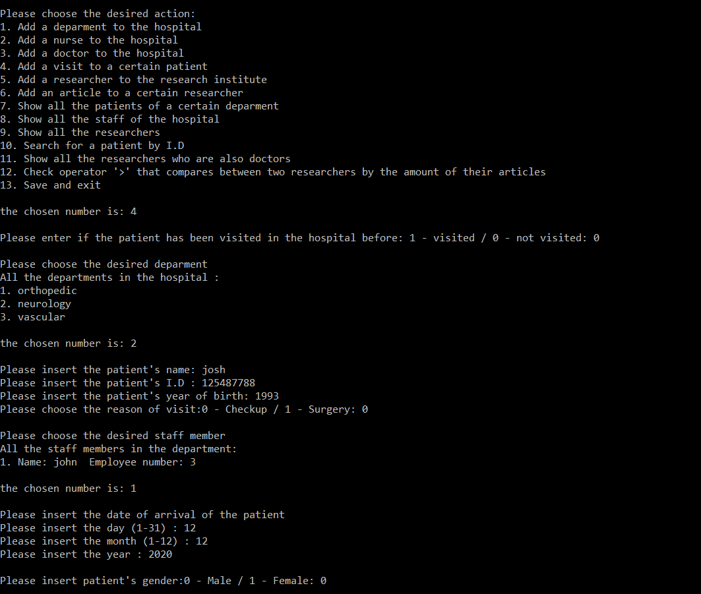

# Hospital

Hospital is a console application I develop using c++,
the project's target was to build application to manage hospital staff.


## Screenshots

 
 


## Built With

* C++ -  C++ is a general-purpose programming language.

* [Visual Studio ](https://visualstudio.microsoft.com/) - visual studio is  an integrated development environment (IDE) from Microsoft.


```
